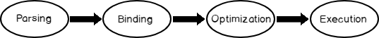

# Hodag SQL query processor

Hodag is an experiment in applying several new ideas.

This repository contains:

  * a fast context-free lexer of SQL tokens
  * a fast hybrid parser for (most of) SQL
  * a parser for (logical, mathematical, and predicate) expressions
  * a rule-based optimizer with a "supply chain" metaphor

**WARNING: This project exists solely for educational reasons.
It is not production quality.**

Hodag can process SQL queries very quickly.
An average query takes only a few dozen milliseconds to parse and optimize.

Hodag might be suitable for adaptive query processing (AQP).
Prior optimizers are not suitable for JIT query processing because their overhead for
parsing and optimizing can be relatively large, compared to the query's execution time.

[[NOTE: A "hodag" is a mythical beast invented by Wisconsin lumberjacks around the
period that Minnesota lumberjacks invented the tales of Paul Bunyan.]]

## STATUS
| Version| Status                             |
|--------|------------------------------------------------------|
| 0.0.1 (June 2023)| "Works" for simple SQL select queries as a way to experiment with ideas for an query processing framework. The ~4K lines of Javascript code is very rudimentary and buggy. It written in "hackathon" style with little concern for good engineering. Performance is very good. It has a very small memory footprint and takes under 20 milliseconds for the browser to package the query, send it to the back-end, and receive a response. |
| 0.0.2| Better parsing of JOIN syntax (Note: SQL sucks) These should produce the same plan for: (1) select eee from tt1 full outer join tt2 where tt1.aaa = tt2.aaa, (2) select eee from tt1 full outer join tt2 using (aaa), (3) select eee from tt1 full outer join tt2 on tt1.aaa = tt2.aaa, and (4) select eee from tt1 natural full outer join tt2|.
| 0.0.3| Begin implementing metaheuristics. Local contracts work for a few cases. |
| 0.0.4| Added crude "CREATE TABLE" support. At start of server, create fake "tt1" and "tt2" tables for testing. Can later add new tables with the SQL command.|
| 0.0.5  | Added early support for functions.                                                                                                                  |

FUTURE plans:

  * TESTING, TESTING, TESTING!!
  * add support for INSERT/UPDATE/DELETE queries
  * add more/better optimization rules
  * connect the plan generation with a query execution/storage back-end
  * better error handling everywhere...

## How to Use it

To run the query processing back-end with node.js:

$ node sql_server.js
(optionally, use "node --trace-uncaught" to get stack traces)

For testing, open the client webpage file in any browser:

 sql_client.html

Then simply enter a query into the webpage's form.
The browser will package the query and send the request to the back-end's network port.

See the metadata.js file for which fake table names can be queried.
Try "select * from tt1" or "select ddd from tt1 left join tt2".
Look in metadata.js for (fake) table definitions.

## Internal Phases

Hodag operates in multiple phases:

  1. Lex to make an array of tokens from an input string
  2. Parse the lex tokens to form a "context block"
  3. Validate the context block (eg, validate, bind to metadata)
  4. Convert validated context block to a tree
  5. Build contracts in tree for "supply chains"
  6. Optimize plan tree by running rules

### Lexing
Compiler generation tools have been used for decades.
While the tools help a project initially, the tools eventually are troublesome.
Most mainstream languages now choose hand-written lexers/parsers.

Hodag uses regular expressions to quickly tokenize an input string.
Currently all of the input is tokenized as a separate phase.
A future enhancement could be to convert the code to an incremental lexer.

### Parsing

Instead of a heavy-weight parser-generator (such as ANTLR, YACC, or Bison) or parser libraries
(such as PEG or Nearley), Hodag uses a simple grammar-driven hybrid parser that is somewhat similar to Treesitter.
The grammar is specified in JSON file with a BNF-style syntax.

The parser is vaguely LR(1) that advances by successful pattern matching.
Unsuccessful matches cause backtracking.

Hodag's parser uses 6 productions: ALLOF, ANYOF, REPEAT, RULE, FUNCTION, and TERMINAL.

ALLOF is a sequence where all of its ordered elements must be matched for the production to succeed.
A new context element can be created with the "classname" element.

ANYOF is successful if any element succeeds.
Ambiguity is prevented by trying to match elements in the order of the rule's definition.

REPEAT is successfully matched if its element occurs between minrepeat and maxrepeat times.
Optional elements have a "minrepeat" of zero.
Think of this as a equivalent to the syntactic notation '*' (Kleene) rule.
With a "minrepeat" of one, it equates to a '+' matching rule.

RULE invokes a named grammar rule.
While not strictly needed, this verb avoids duplicate code by allowing the same element to be used in multiple locations.

FUNCTION invokes a Javascript function.
This is preferred when the parsing can be more simply implemented in Javascript, such as to give better error messages.

TERMINAL matches an atomic element, such as a keyword, punctuation symbol, number, or variable name.
A terminal can be used to set a property of the current context object with the "propname" element.

The parser incrementally converts a SQL statement into a "context block" which is later transformed into a tree of operators that can be optimized,

### Optimizing is hard

Query optimization is a hard combinatorial optimization problem.
Using exact algorithms to solve it is unfeasible.
No query optimizer guarantees that it will find the globally optimal plans.
Query optimization needs to implement three difficult tasks:

 1. generate a search space, using algebraic transformations
 1. estimate cost of each plan in the search space
 1. an enumeration algorithm to walk through the search space

Many concepts and design decisions from the System R optimizer are still used today
by using a model to estimate the cost of executing a plan.
In general, an optimizer generates a mapping of a logical algebra expression to the optimal equivalent physical algebra expression, evaluates multiple equivalent plans for a query and picks the one with the lowest cost.
Two relational algebra expressions are equivalent if they generate the same output set of tuples.

In general, there are three ways to search:

 1. Use an enumerative method that searches until it finds the optimum solution.
Unfortunately it might run for a long time.
 1. Use an approximation algorithm that runs in polynomial time. If no polynomial-time algorithm can solve a problem, it is an intractable problem.
 1. Use a heuristic technique without any a guarantee for the quality of a solution and time needed. Heuristic means ‘to discover solutions by 'trial and error’.

Researchers have tried many approximation and heuristic techniques:

 * Early optimizers used mainly semantic rewriting (based on relational algebra or calculus)
 * IBM's System R optimizer added cost estimates with dynamic linear programming
 * Extensible frameworks (eg, Volcano) added rules to build the search space

Much work has aimed at efficient implementation of joins, because relational systems commonly call for joins, yet face difficulties in optimizing their efficient execution.
The problem arises because inner joins operate both commutatively and associatively.
In practice, this means that the user merely supplies the list of tables for joining and the join conditions to use, and the database system has the task of determining the most efficient way to perform the operation.

A desirable optimizer is one where
(1) the search space includes only correct plans,
(2) the costing technique is accurate, and
(3) the enumeration algorithm is efficient.

Optimizers can work top-down or bottom-up.
Top-down is a goal-oriented search strategy for finding the cheapest plan in the space of possible plans.
On the other hand, bottom-up evaluation can have a lower time complexity than top-down strategy.

Optimizers can range from static to dynamic planning.

| Plan type      | Execution properties                                 |
|----------------|------------------------------------------------------|
| Static         | Fixed plan does not change throughout query execution|
| Feedback       | Change metadata statistics if plan diverges          |
| Adaptive       | Re-optimizes a query plan during execution.          |
| Self-optimizing| Choose a plan at runtime based on live measurements  |

Adaptive optimization is helpful when existing statistics are not sufficient to generate an optimal plan.

For a SQL optimization, the concept of "row-ness" is used to express how independent columns are in a row.
This concept is different from the relational "dependence" concept that is used for keys and normalization.
Row-ness means that values are linked by their storage in the same row.

Optimizers struggle to contain the explosion of the search space.
Many factors related to query performance are vague and difficult to quantify.
The best choice depends on computer architectures, runtime data characteristics, etc.
It can be very difficult to know, a priori, which plan is best.
Even if you choose correctly today, the best choice is likely to change as the system changes over time.

To apply Linear Programming for optimization these requirements have to be met:

  *  Problem statement: define the objective in clear mathematical terms
  *  Decision variables: quantitative input variables impacting the objective
  *  Constraints: quantitative and measurable conditions
  *  Objective function: the relationship between the objective and the input variables has to be linear

Despite the inability to truly optimize a query, optimizers usually find a "good enough" plan in a feasible time with fewer resources.
The optimizer selects the execution plan with the lowest estimated cost, which it predicts will be the fastest and most efficient.
This makes a cost-based optimizer more capable in handling complex queries.

## Normal heuristics

Multiple heuristics are commonly used:

 1. Projection pushdown
 2. Eliminate impossible/unnecessary predicates
 3. Join elimination and re-ordering
 4. Eliminate unnecessary projections and selections
 5. Substitute for simpler relational algebra equivalences
 6. Rewrite sub-queries to de-correlate and/or flatten them

These heuristics can be implemented as rules.

## Hodag's Approach

Hodag has two optimization patterns - metaheuristics and "supply chain" contracts.
This approach can support handling of pre-conditions, invariants, and post-conditions.

At a global operator level, Hodag uses a "contractual supply chain" metaphor, which is an agreement that its children operators will supply the required properties.
The supply chain problem can been formulated as a conventional LP problem model with a cost function.
Each node in a plan tree makes a contract with its parent and children nodes.
For example, a node can require its child node to deliver a solution with certain properties.
Thus the recursive chain of contracts defines the entire tree.
Instead of solving the entire tree at one time, the optimizer breaks a problem into multiple subproblems
and solves each one of them to provide a global result.

At a local level, Hodag uses a metaheuristic approach to generate possible plans that support a contract.
Metaheuristics, an unfortunately named term, do not stop in the first local optimum as a simple heuristic does.

Metaheuristics aim to find promising results for a problem
even when the shape of optimal solution is not know beforehand.
It is a subfield of stochastic optimization, but metaheuristics do not produce alternatives randomly.
Heuristics is a general guideline to solve problems, not a specific algorithm.

Metaheuristics follow the pattern of US Supreme Court justice Potter Stewart who
facetiously (?) wrote that he could not define porn but he knew it when he saw it.

Hodag splits optimization into a phase that generates alternatives and a phase that evaluates them.
So an operator might not know how to find a new subplan, but the operator can run a cost function.

The area of metaheuristics has a collection of strategies that uses information about the problem to find promising solutions.
Candidate solutions are assessed for fitness according to a objective function.
Heuristic, metaheuristic, and probabilistic algorithms are non-exact strategies.

Many metaheuristic algorithms have been proposed in recent years.
Some examples from the first generations of these algorithms
are Genetic algorithm, Genetic Programming, Evolutionary Programming, Tabu Search,
Simulated Annealing and Particle Swarm Optimization.
These were followed by the Ant Lion optimizer, Artificial Algae algorithm, Binary Bat Algorithm, Black Hole algorithm, Binary Cat swarm optimization,
Firefly algorithm, Fish swarm algorithm, Grey Wolf optimizer, Krill Herd algorithm, Hunting search, Imperialist Competitive algorithm, Lion algorithm,
Shuffled Frog-Leaping algorithm, Multi-Verse optimizer, Water Cycle algorithm, etc. etc. etc.

|                | Algorithmic | Heuristic | Meta-heuristic | Random |
|----------------|-------|-----------|----------------|----------|
| Optimal Answer | Guaranteed | Maybe | Maybe | Maybe |
| Correct Answer | Guaranteed | Guaranteed | Guaranteed | Maybe |
| Execution time | Slow | Fast | Fast | Unknown |

An optimizer chooses among equivalent relational algebra expressions to transform the initial tree into the final, optimized query tree.
The Hodag optimizer uses statistics about the data stored in the database, such as data distribution, storage indexes, and the database's current state,
to estimate the "cost" of potential execution plans.
Costs relate to factors such as I/O, CPU usage, and network latency.

Hodag combines contracts and metaheuristics to implement an optimizer that is very fast and small.

### Optimizer Rules

Many optimizers now use rules as a way to extend the base optimizer.

To generate equivalent plans, Hodag uses rules to transform the original plan.
Two plans are equivalent if both produce the same results for the same inputs.
However, not all equivalent plans have equal performance.

The goal is to permit "good" moves in each iteration without re-visiting solutions already encountered.

To avoid repetitive work, a Volcano/Cascades style of optimizer use memoization
of sub-plans to detect duplicate patterns.
However, memoization does not capture either context or history.
A pattern created and rejected early in the optimization process might prevent its use later despite that the context is different.
Plus a memoized subplan might prevent a later exploration that leads to the discovery of a better plan.

In contrast, Hodag inverts the idea of memoization of results by allowing a Tabu-style history of the rule executions.
A Tabu-style history gradually forgets to allow better optimizations to be tried again instead of keeping the first candidate.

Rules in Hodag are defined by each type of node.
For example, the JOIN node has rules that are only for transforming a JOIN node according to a contract.

In contrast to other optimizers, the Hodag splits the execution of rules into two phases
to overcome the limitations of local optimality.
In the generation phase, a child node runs its rules to generate potential solutions for plan transformations.
The child passes an array of these *candidate* transformations to its parent.
In the evaluation phase, the parent evaluates all of the candidates to possibly pick the best candidate to transform the current tree.
The parent evaluates each candidate by using its current context.

Variants are possible in the generation phase is to change the status of a rule.
One variant has a Tabu-style history where rules are (temporarily) "taboo" (blocked) so that the node does not reconsider running the same rule.
Many other variants are possible, such as re-ordering rules, accept hints, and randomly choosing rules.

### Need for speed

The performance of an optimizer is important; a slow optimizer degrades the overall system.

In addition to optimizing relational operators, Hodag will also try to simplify/minify boolean expressions by applying
the normal logic simplification rules, such as commutative law, distributive law, identity law, negation law, double negation (involution) law, idempotent law, complement law, absorption law, redundancy law, and de Morgan's theorem.
Conceptually, Hodag uses a directed graph with nodes representing truth- or falsehood.
At each node, the value of the Boolean variable is reduced with respect to the following reduction rules:

   * Given two nodes with the same variable label, same true-path and same false-path, one of them can be replaced.
   * Given a node whose true-path and false-path coincide, the node can be removed.

### Plan Evaluation
Decades after IBM's innovative cost-based optimizer, nearly all optimizers evaluate a plan by its cost.
Traditional optimizers use a single fitness function (ie, "cost"), but Hodag allows for optimizing based on multiple functions.

Problems that have more than one objective is referred to as multi-objective optimization (MOO).
Multi-objective optimization is useful for problems where optimal decisions need to be taken in the presence of trade-offs between multiple objectives.
For example, maximizing performance and minimizing cost.

In recent years, multi-objective optimization techniques have become popular due to their potentiality in solving a wide variety of real-world problems.
There are different methods and techniques for solving multi-objective optimization problems, such as the Pareto method and the scalarization method.
The Pareto method finds a set of solutions that are not dominated by any other feasible solutions, meaning that none of the objective functions can be improved without degrading some of the other objectives.
The scalarization method combines multi-objective functions into a single solution using weights.
Although the weighted-sum method is simple and easy to use, there are two inherent problems.
First, there is difficulty in choosing weights for problems that have different magnitudes.
Second, the weighted function is not convex.

Decision-making usually involves choosing from a limited range of options.
When cost is the only criterion, the decision is straightforward.
For MOOs, a multi-criteria decision analysis is often used to choose among alternatives.
There are many variants, but the weighted-sum method is the most common.
This technique appears superficially simple, logical and intuitive.

In Hodag's plan evaluation, the optimizer starts by eliminating any options that fail to deliver one or more required contract properties.
The second stage involves evaluating the remaining options according to non-required properties.
Hodag currently uses a total-tree cost function.

For example, a join node might require the delivery of specific columns.
Candidate sub-plans are eliminated if they do not produce those columns.
All remaining candidates are then ranked by a cost function that is calculated
from multiple objectives (eg, memory use, I/Os, locking, sortedness, parallelization).

## Query execution

In the early days of relational databases, performance was limited by slow disks, slow CPUs, and limited memory.

As hardware exponentially improved (Moore's Law), database technologies used ever faster uniprocessors and bigger memory.

By 2000-2010 when uniprocessor speeds hit their maximums of clock-rate and heat-generation, CPU designers switched to multi-core CPUs.

Over the past 10-15 years, core throughput increases have slowed, so CPU designers have scaled up core counts to continue increasing performance.
The first generation of multi-core CPUs had 2 cores.
Now CPUs typically have 4-20. By 2030, CPUs will have 100s of cores.
Database designers have not adopted to this newer hardware.
Most DBMS code was initially written before multi-core CPUs and "big data".

Hodag might be useful for dynamic re-optimization when a query's real execution
cost is discovered at run-time and the remaining steps of the query can be improved.
